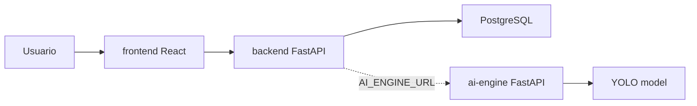

# SmartRecycleAI Architecture

## Principios

- Separacion estricta entre UI, API operativa, motor de IA y datos.
- Contratos HTTP entre modulos para evitar importaciones cruzadas.
- Configuracion por variables de entorno con `.env.example` como contrato.
- Persistencia centralizada en PostgreSQL mediante SQLAlchemy y Alembic.
- Preparacion para despliegues independientes con Docker.

## Modulos

### Frontend

`frontend/` contiene la aplicacion React. Su unica dependencia hacia el resto del sistema es HTTP mediante Axios. No conoce SQLAlchemy, Alembic, OpenCV ni YOLO.

Responsabilidades:

- Navegacion de experiencia operativa.
- Componentes reutilizables.
- Consumo de `backend` por `VITE_API_BASE_URL`.
- Animaciones e interfaz responsive.

### Backend

`backend/` contiene la API principal de negocio con FastAPI. Maneja datos operativos, validacion de contratos y persistencia.

Responsabilidades:

- Endpoints versionados en `/api/v1`.
- Modelos SQLAlchemy.
- Esquemas Pydantic.
- Migraciones Alembic.
- Coordinacion futura con `ai-engine` via `AI_ENGINE_URL`.

### AI Engine

`ai-engine/` contiene el motor de vision artificial. Puede ejecutarse como API HTTP o CLI, y carga el modelo YOLO bajo demanda.

Responsabilidades:

- Validar imagenes.
- Ejecutar inferencia con Ultralytics YOLO.
- Devolver detecciones normalizadas.
- Mantener dependencias de IA fuera del backend.

### PostgreSQL

PostgreSQL es la base de datos operativa principal. El esquema se controla por Alembic desde `backend/alembic`.

## Flujo de datos

## Limites de acoplamiento

- `frontend` no importa codigo Python.
- `backend` no importa codigo de `ai-engine`.
- `ai-engine` no accede directamente a PostgreSQL.
- La comunicacion entre servicios ocurre por HTTP y variables de entorno.

## Preparacion empresarial

- Docker Compose para desarrollo integrado.
- Dockerfile por servicio.
- Workflow CI para build y pruebas iniciales.
- Scripts de verificacion local.
- Estructura lista para ampliar dominios, servicios y pipelines.
